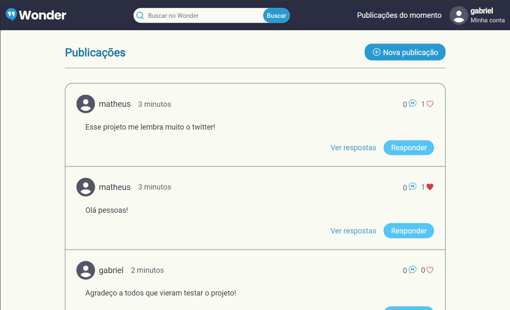
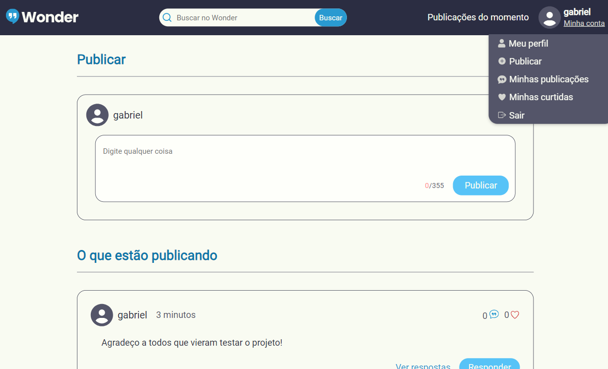
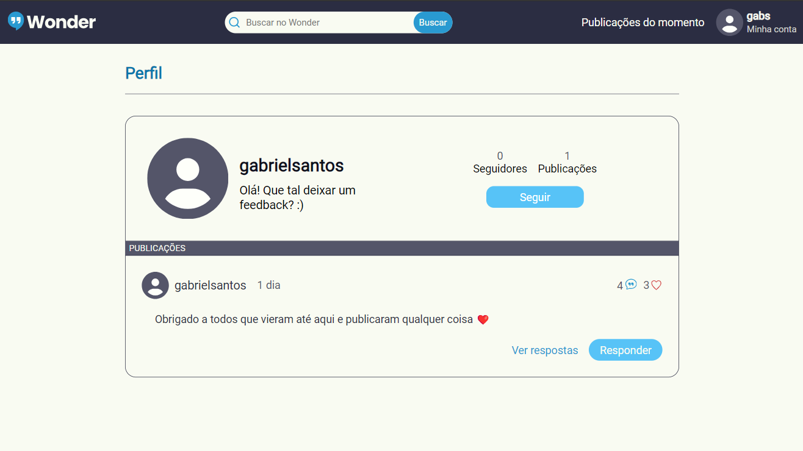
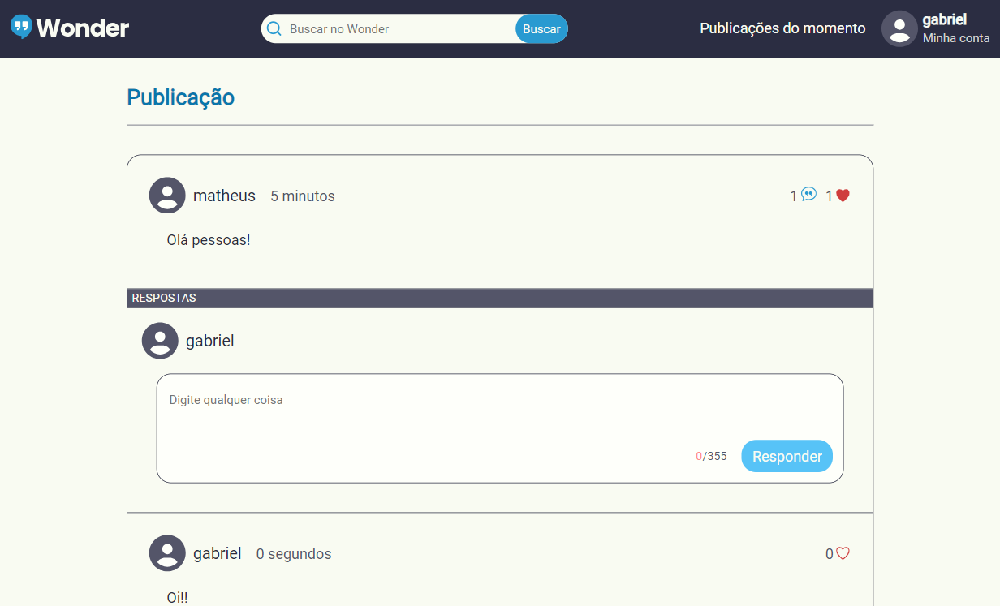

#   Wonder 
Wonder é uma rede social que nasceu com o objetivo de enfatizar a liberdade de expressão individual. Sua interface é bastante intuitiva, permitindo que os usuários aprendam facilmente a fazer uma publicação. O projeto é focado em permitir que os usuários publiquem mensagens de texto, proporcionando uma plataforma aberta para expressão. Qualquer usuário pode criar uma publicação, além de curtir e responder às publicações de outros. Sua abordagem e interface são semelhantes ao X, antigo Twitter, proporcionando uma experiência familiar aos usuários.

Quer fazer a sua primeira publicação? Basta acessar o [Wonder](https://wonderr.me).
##### **IMPORTANTE!**

> Talvez ao tentar acessar o Wonder, possa demorar alguns minutos para que a página carregue e mostre as publicações. Isso acontece devido a API do projeto está hospedada no [Render](https://render.com), mas não se preocupe que dentro de um minuto a página carregará normalmente e as publicações serão mostradas.

## 🎨 Layout

| Home | Criação de publicação |
|----------|----------|
|  |  |

| Perfil do usuário | Viasualização da publicação |
|----------|----------|
|  |  |

## ⚙️ Descrição do projeto

No design, foi utlizado o Figma e os princípios do design UI e UX para proporcionar uma ótima experiência ao usuário, garantindo uma interface intuitiva e agradável.

No FrontEnd, foi utilizado o React como biblioteca principal, o que facilitou o desenvolvimento e contribuiu para a intuitividade do projeto. No momento, a responsividade ainda não foi implementada, mas será o foco das próximas atualizações.

O projeto está completamente funcional, com todas as suas páginas e funcionalidades desenvolvidas. 

Para saber mais informações sobre a api do projeto, basta clicar [aqui](https://github.com/gabriel-augg/api-wonder).

## 💻 Tecnologias

- JavaScript
- React
- ContextAPI
- Axios
- React-router-dom
- React-hook-form
- Zod
- HTML
- CSS
